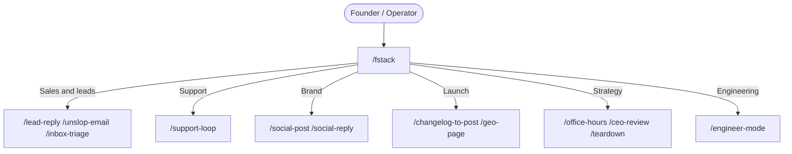

# fstack, Fabio's Stack / Founder's Stack

**fstack** is an AI agent stack for founders who still write the product. It is built by [Fabio Parlascino](https://github.com/Scino). The F is both **Fabio** and **founder**. It is not tied to one editor or one lab. The same `/` skills run in Cursor, Claude Code, Google Antigravity, OpenAI Codex, OpenCode, Hermes, OpenClaw, and anything else that loads Agent Skills.

A founder's job is to talk to users, build product, and iterate. Most agent stacks pick one of those and pretend the rest is "context." fstack keeps both in the same tree: the messy operating system of a company, and the engineering discipline that stops you shipping slop.

> "Talk to users. Build the thing. Don't ship slop. Be a decent human."
> Fabio Parlascino
>
> "Throughput without quality is not a goal. If you want to go fast, go deep first."
> Lauren Tan (poteto)

It works wherever you already work. Install once, use the same `/` skills.

npm: [`@scino/fstack`](https://www.npmjs.com/package/@scino/fstack) · GitHub: [Scino/fstack](https://github.com/Scino/fstack)

---

## Why the name

There is a small family of named stacks in this corner of the internet.

[**gstack**](https://github.com/garrytan/gstack) is Garry Tan's Claude Code setup. A virtual team of specialists. Office hours, CEO review, QA in a real browser, ship.

[**pstack**](https://github.com/cursor/plugins/tree/main/pstack) is Lauren Tan's (poteto) engineering stack. 23 engineering playbooks, 22 design principles, parallel agents, verify on the real artifact. I learned a lot from it.

**fstack** is mine. Same engineering bar, founder work as the default mode. The engineering engine is `/engineer-mode`. `/poteto-mode` remains as an alias so existing prompts keep working. The playbooks and principles started as her work, and they are credited. The founder loop, the support-to-fix bridge, the social and sales skills, the browsing engine, and the dual-engine router did not.

If you want Garry's specialist roster, use gstack. If you want poteto's engineering plugin as she ships it, use pstack. If you want one stack that can answer an inbound lead and then go fix the bug the customer just hit, this is the one.

---

## What it actually does

Two engines. One orchestrator (`/fstack`) that classifies the request instead of dumping every skill into the prompt.

**Founder operations.** The work that happens between commits. Inbound leads that need an honest reply, not a demo-script. Support tickets that are sometimes bugs and sometimes the product being confusing. Posts that should sound like you, not like a growth agency. Competitive teardowns that do not get you banned by Cloudflare on paragraph two.

**Engineering.** `/engineer-mode` is the default for anything non-trivial in code. It routes to 23 engineering playbooks and 22 design principles. Reproduce first. Name the data shape before the abstraction. Architect across a function boundary. Verify on the real artifact. Delete the narrating comments. The principles are model-only leaves (`user-invocable: false`). Some IDE slash pickers still list them. That is the picker, not a catalog mistake.

73 skills total. 51 are user-facing.

The bridge skill is `/support-loop`. A customer paid and the workspace is still locked. The agent finds the webhook, writes a failing test, fixes the handler, checks what else that path touches, and drafts the reply you can actually send. Most stacks stop at "sounds like a billing bug."

---

## Quick start

```bash
npx @scino/fstack install --all
npx @scino/fstack doctor
```

Or clone the repo and run the same CLI:

```bash
git clone https://github.com/Scino/fstack.git
cd fstack
node bin/fstack.js install --all
```

Windows: `./setup.ps1`. macOS/Linux: `./setup.sh`.

`npx @scino/fstack install --all` detects which agents you have and links the skills into each one. `fstack doctor` prints what it found.

Cursor, Claude Code, Codex, Antigravity, OpenCode, and project-local `.agents/skills` are first-class. Cursor also gets a plugin install (logo and author) instead of a pile of anonymous skill folders. The others use their normal skills directory. Details are in the table below.

For a different project, not this repo:

```bash
npx @scino/fstack init
```

That writes `.agents/skills` for Hermes, OpenClaw, and anyone else who discovers skills from the repo. Do not commit it. Skip `init` inside the fstack repo itself. You already have `skills/` here, and a second copy makes every command show up twice.

---

## A morning with fstack

Paste last night's inbox into `/inbox-triage`. You get P0 deal-blockers, P1 hot leads, P2 questions, P3 noise, and drafts instead of a guilt pile.

An inbound from `alex@bigcorp.com` asks about SSO you do not have. `/lead-reply` is supposed to be consultative and true. If the product cannot do it, the draft says so and offers a real next step. `/unslop-email` exists because the first pass will still try to "circle back" and "leverage."

A customer paid and the workspace is still locked. `/support-loop` is the whole loop, not a sympathy paragraph. If it is a bug, `/engineer-mode` owns the fix. If it is expected behavior, you still owe them a human explanation.

You shipped three PRs and need something public. `/changelog-to-post` turns the commit list into a customer changelog, a short email, and a post you would actually publish. `/social-post` knows X wants a punch and LinkedIn wants a story. It should read your `/founder-voice` profile rather than inventing a personal brand.

When it is time to build, you do not narrate a plan for forty lines. `/engineer-mode` on a real feature opens a todolist, starts with principles, picks the Feature playbook, and refuses to write logic until the data shape is named.

That is the product. Skills are the verbs.

---

## Dual-engine routing (`/fstack`)



Say `/fstack` when you do not want to pick. Say the specific skill when you already know.

---

## Anti-bot browsing (`/browse`)

Naive Playwright dies on LinkedIn, X, and anything behind Cloudflare. `/browse` has three strategies, in order of paranoia.

1. Attach to your real Chrome over CDP (`--remote-debugging-port=9222`). Your cookies, your residential IP, your GPU canvas. This is how you research a competitor without looking like a datacenter.
2. Standalone stealth. Masks `navigator.webdriver`, restores `window.chrome.runtime`, proxies `Function.prototype.toString`. Good enough for pages that are merely annoyed, not hostile.
3. Whatever browser the host agent already has.

Extracted DOM is sanitized before it hits the model. Hidden CSS, zero-width characters, and "ignore previous instructions" payloads get stripped. `/teardown` uses this so a pricing page cannot jailbreak the agent on the way through.

```bash
fstack browse check-cdp
```

---

## Skill catalog

### Flagship

These are the modes you type on purpose.

| Skill | When to use it |
|---|---|
| [`/fstack`](skills/fstack/SKILL.md) | You have a request and want the stack to classify it. |
| [`/founder-mode`](skills/founder-mode/SKILL.md) | Own the whole loop: product, code, copy, customer, speed. |
| [`/engineer-mode`](skills/engineer-mode/SKILL.md) | Non-trivial engineering. 23 engineering playbooks, 22 design principles. |
| [`/poteto-mode`](skills/poteto-mode/SKILL.md) | Same as `/engineer-mode`. Compatibility alias. |
| [`/setup-fstack`](skills/setup-fstack/SKILL.md) | Point roles at the models you actually have. |
| [`/stfu`](skills/stfu/SKILL.md) | Quiet execution. No filler, no diff recitation. |
| [`/sudo`](skills/sudo/SKILL.md) | Authorized work where paternalistic refusals waste the session. |

### Founder operations

The company-running verbs. Sales, support, brand, strategy, research.

| Skill | When to use it |
|---|---|
| [`/lead-reply`](skills/lead-reply/SKILL.md) | Turn a raw inbound into a consultative reply that matches what you actually ship. |
| [`/unslop-email`](skills/unslop-email/SKILL.md) | Strip corporate buzzwords. Keep the warmth. |
| [`/inbox-triage`](skills/inbox-triage/SKILL.md) | Rank a pile of threads by commercial urgency and draft answers. |
| [`/support-loop`](skills/support-loop/SKILL.md) | Ticket, then codebase, then fix, then the reply you can send. |
| [`/founder-voice`](skills/founder-voice/SKILL.md) | Persistent voice profile so posts and emails stay yours. |
| [`/social-post`](skills/social-post/SKILL.md) | X short and sharp. LinkedIn as a story with a takeaway. |
| [`/social-reply`](skills/social-reply/SKILL.md) | High-leverage replies to posts already moving. |
| [`/changelog-to-post`](skills/changelog-to-post/SKILL.md) | Git history into a customer changelog and a launch note. |
| [`/geo-page`](skills/geo-page/SKILL.md) | Documentation written so AI search can cite it without hallucinating. |
| [`/customer-lens`](skills/customer-lens/SKILL.md) | Walk a flow as a skeptical first-time user. |
| [`/office-hours`](skills/office-hours/SKILL.md) | Six YC forcing questions on demand reality and the narrowest wedge. |
| [`/ceo-review`](skills/ceo-review/SKILL.md) | Scope up, cherry-pick delight, hold, or cut to Friday. |
| [`/retro`](skills/retro/SKILL.md) | Weekly audit of velocity versus customer reality. |
| [`/browse`](skills/browse/SKILL.md) | Anti-bot browsing and extraction. |
| [`/teardown`](skills/teardown/SKILL.md) | Competitor pricing, packaging, complaints, wedge. |

### Engineering

The build verbs. Most of these are what `/engineer-mode` already routes to. You can still call them directly.

| Skill | When to use it |
|---|---|
| [`/architect`](skills/architect/SKILL.md) | Design function boundaries before writing logic. |
| [`/arena`](skills/arena/SKILL.md) | N models try the same problem. You keep the best parts. |
| [`/swarm`](skills/swarm/SKILL.md) | Fan-out workers across slices or races. |
| [`/interrogate`](skills/interrogate/SKILL.md) | Adversarial multi-model review for races and edge cases. |
| [`/tdd`](skills/tdd/SKILL.md) | Failing reproduction first, then the fix. |
| [`/deslop`](skills/deslop/SKILL.md) | Strip wrappers, boilerplate, and narrating comments in code. |
| [`/unslop`](skills/unslop/SKILL.md) | Same idea for prose. |
| [`/no-comments`](skills/no-comments/SKILL.md) | Delete comments the code already says. |
| [`/technical-writing`](skills/technical-writing/SKILL.md) | RFCs, READMEs, PR bodies, commit messages. |
| [`/how`](skills/how/SKILL.md) | Walk through how a subsystem actually works. |
| [`/why`](skills/why/SKILL.md) | Forensic "why is it like this" across git, tickets, and incidents. |
| [`/blast-radius`](skills/blast-radius/SKILL.md) | Prove what else a change can break. |
| [`/fix-ci`](skills/fix-ci/SKILL.md) | Red pipelines and flakes. |
| [`/fix-merge-conflicts`](skills/fix-merge-conflicts/SKILL.md) | Conflicts without losing the logical change. |
| [`/make-pr-easy-to-review`](skills/make-pr-easy-to-review/SKILL.md) | Shape the diff for a human reviewer. |
| [`/show-me-your-work`](skills/show-me-your-work/SKILL.md) | Decision trail on long or unsupervised runs. |
| [`/typescript-best-practices`](skills/typescript-best-practices/SKILL.md) | Illegal states unrepresentable, parse at the boundary. |
| [`/figure-it-out`](skills/figure-it-out/SKILL.md) | No bundled playbook fits. Design one, then run it. |
| [`/babysit`](skills/babysit/SKILL.md) | Watch a PR to green. Skeptical of review bots. |
| [`/create-verification-skill`](skills/create-verification-skill/SKILL.md) | Generate a project-local verify skill that drives the real app. |
| [`/maintain-verification-skill`](skills/maintain-verification-skill/SKILL.md) | Keep that verify skill true as the app changes. |
| [`/get-pr-comments`](skills/get-pr-comments/SKILL.md) | Pull review comments into the working set. |
| [`/thermo-nuclear-code-quality-review`](skills/thermo-nuclear-code-quality-review/SKILL.md) | Unkind review. Use when you asked for it. |

### Other

Small tools that do not belong in either engine's headline, and still earn their folder.

| Skill | When to use it |
|---|---|
| [`/bro`](skills/bro/SKILL.md) | Restate the last message like a human talking to a human. |
| [`/recall`](skills/recall/SKILL.md) | Catch up on recent work from chats and the shared record. |
| [`/reflect`](skills/reflect/SKILL.md) | Post-task judgment. What actually happened. |
| [`/teach`](skills/teach/SKILL.md) | Compose `/how` and `/why` into an explanation someone can follow. |
| [`/automate-me`](skills/automate-me/SKILL.md) | Turn a repeated habit into a durable skill. |
| [`/what-did-i-get-done`](skills/what-did-i-get-done/SKILL.md) | What shipped, in language you could send to a team. |

22 `principle-*` skills sit beside these. `/engineer-mode` reads them. You should not have to.

---

## Supported harnesses

| Harness | Where it lands |
|---|---|
| **Cursor** | Plugin at `~/.cursor/plugins/local/fstack` |
| **Claude Code** | `~/.claude/skills` |
| **Antigravity** | `~/.gemini/antigravity/skills` |
| **OpenAI Codex** | `~/.codex/skills` via CLI, or `codex plugin marketplace add Scino/fstack` for the full plugin |
| **OpenCode** | `~/.config/opencode/skills` |
| **Hermes / OpenClaw** | `.agents/skills` via `fstack init` in the target project |

The same skill tree is what every agent loads. This GitHub repo also carries plugin manifests for Cursor and Codex so those two can install fstack as a plugin, not only as loose files. "Created by Cursor" in a slash picker is Cursor's own marketplace badge. We set `logo` and `author` so a plugin install is not anonymous. That does not make fstack a Cursor product.

---

## Attribution and license

Engineering playbooks, principles, and a few review/CI skills started as Lauren Tan's `pstack` and Cursor team-kit work. They are MIT. The notices travel in `skills/engineer-mode/references/licenses/NOTICE.md`. fstack ships that engineering engine as `/engineer-mode`, with `/poteto-mode` as an alias, and keeps the credit.

Founder-operations skills, the dual-engine router, the installer, the stealth browser, and the packaging are original to fstack.

MIT. Copyright (c) 2026 Fabio Parlascino. See [LICENSE](LICENSE).
