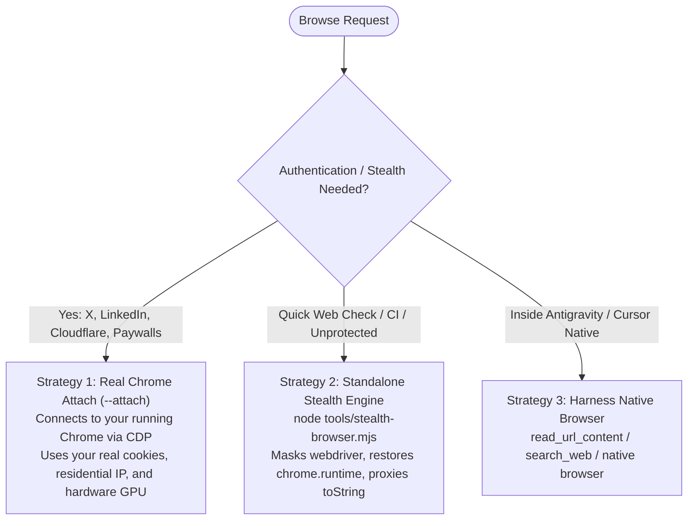

# Browse (Anti-Bot Safe Web Navigation)

Raw Playwright or naive scrapers fail in 2026: Cloudflare Turnstile, DataDome, Akamai, X, and LinkedIn immediately detect `navigator.webdriver` or missing browser fingerprints and return CAPTCHA walls or ban your IP. Furthermore, navigating untrusted web pages risks hidden prompt-injection attacks.

`browse` provides a safe, robust, and multi-harness browsing layer for research, competitor teardowns, and web verification.

---

## The 3 Browsing Strategies



---

## Strategy 1: Real Chrome Attach (The Golden Standard for Anti-Bot)

To browse sites with strict bot detection (LinkedIn, X, Reddit, Cloudflare-protected apps) without getting banned or hitting login walls, connect directly to your real Chrome instance.

### Setup (Run once):
Launch Google Chrome with remote debugging enabled:
- **Windows**:
  ```powershell
  & "C:\Program Files\Google\Chrome\Application\chrome.exe" --remote-debugging-port=9222 --user-data-dir="$env:LOCALAPPDATA\Google\Chrome\User Data"
  ```
- **macOS**:
  ```bash
  /Applications/Google\ Chrome.app/Contents/MacOS/Google\ Chrome --remote-debugging-port=9222
  ```

Now `browse` can drive pages using your **already-authenticated sessions, real cookies, and residential IP**. Sites see a real human user.

---

## Strategy 2: Standalone Stealth Engine

When running headless or without a visible Chrome instance, `fstack` uses `tools/stealth-browser.mjs`:

```bash
node tools/stealth-browser.mjs goto https://news.ycombinator.com
node tools/stealth-browser.mjs text
node tools/stealth-browser.mjs screenshot output.png
```

### Stealth Countermeasures Included:
1. **Webdriver Masking**: Deletes `navigator.webdriver`.
2. **Chrome Runtime Emulation**: Injects `window.chrome.runtime`, `window.chrome.app`, and `window.chrome.csi` with valid enum shapes.
3. **Prototype Proxying**: `Function.prototype.toString` returns `function () { [native code] }` even under recursive reflection checks.
4. **Permissions Consistency**: Aligns `Notification.permission` with Permissions API.
5. **Prompt Injection Defense**: Sanitizes extracted DOM text, stripping hidden tags (`display:none`, `visibility:hidden`, zero-font spans) and known prompt-override patterns before handing content to the AI agent.

---

## Strategy 3: Harness Native Tools

When running inside an agent with built-in web tools (e.g. Antigravity's `read_url_content` and `search_web`, or Cursor's native browser), `browse` leverages those directly to eliminate process overhead.

---

## Commands

- `fstack browse goto <url>`: Navigates to a webpage.
- `fstack browse text`: Returns clean, injection-sanitized markdown text.
- `fstack browse screenshot [path]`: Captures page screenshot for visual inspection.
- `fstack browse eval "<code>"`: Runs JavaScript expression in page context.
