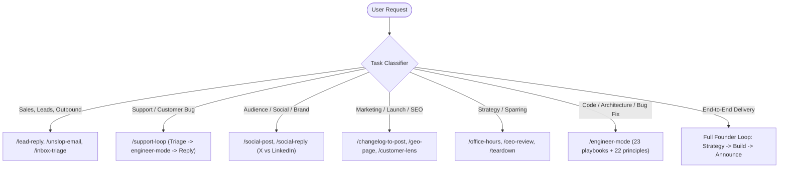

# fstack (Fabio's Stack / Founder's Stack)

> "throughput without quality is not a goal i aspire to. if you want to go fast, go deep first."
> Lauren Tan (poteto)
>
> "Talk to users. Build the thing. Don't ship slop. Be a decent human."
> Fabio Parlascino

`fstack` is a harness-agnostic system designed for founders and technical operators. It bridges two symmetric engines:
1. **The Founder Operations Engine ([`/founder-mode`](../founder-mode/SKILL.md))**: High-agency leverage for sales, customer support, brand growth, product marketing, and speed-to-market.
2. **The Engineering Engine ([`/engineer-mode`](../engineer-mode/SKILL.md))**: World-class engineering rigor with 23 playbooks, 22 design principles, multi-model panels, and zero slop.

---

## The Task Router

When `fstack` is invoked, immediately classify the user's intent into one of three tracks:

### Track 1: Founder Operations (Go-To-Market, Sales, Brand, Support)
- **Inbound Lead / Outbound Pitch** → Route to `/lead-reply` and polish with `/unslop-email`.
- **Customer Issue / Support Ticket** → Route to `/support-loop`.
- **Social Media Post or Growth Reply** → Route to `/social-post` or `/social-reply`.
- **Product Release / Changelog** → Route to `/changelog-to-post`.
- **Competitor Analysis / Pricing Research** → Route to `/teardown` and `/browse`.
- **Strategy & Idea Stress-Test** → Route to `/office-hours` or `/ceo-review`.
- **Weekly Review** → Route to `/retro`.

### Track 2: Engineering Rigor (`engineer-mode`)
- **Bug Fix** → `engineer-mode/playbooks/bug-fix.md` (reproduce first, root-cause, test, fix).
- **New Feature** → `engineer-mode/playbooks/feature.md` (data shape first, architect across boundaries).
- **Refactoring** → `engineer-mode/playbooks/refactoring.md` (behavior-preserving, model-the-domain).
- **Performance** → `engineer-mode/playbooks/perf-issue.md` (measure baseline, trace, verify win).
- **Review / Pre-PR** → `/interrogate`, `/deslop`, `/no-comments`, `/technical-writing`.

### Track 3: The Full Founder Loop (End-to-End)
When a request bridges business and code (e.g. *"Customer X complained about CSV exports breaking on safari, let's fix it, deploy, and reply to them"*):
1. **Triage & Context**: Identify customer pain, relevant files, and user expectations (`/support-loop`).
2. **Execute with Rigor**: Transition into `engineer-mode` (Bug-Fix playbook: write reproduction script/test, fix root cause, verify).
3. **Close the Loop**: Draft the human, context-aware reply for Customer X and update the changelog (`/changelog-to-post`).

---

## Universal Guidelines

1. **No AI Slop Anywhere**:
   - In code: No gratuitous wrappers, no narrating comments (`// increment counter`), no dead abstractions.
   - In prose: No *"In today's fast-paced digital landscape"*, no *"delve"*, no *"comprehensive"*, no corporate throat-clearing.
2. **Model Roles**:
   - Check `models.json` for role mappings (`FastMechanical`, `DeepReasoning`, `StrongestJudgment`, `ProseUnslop`, `DivergentPanel`).
   - Default to your harness's strongest model for judgment, fast model for mechanical edits.
3. **Platform Independence**:
   - Works natively in Cursor, Claude Code, Antigravity, OpenAI Codex, OpenCode, Hermes, and OpenClaw.
