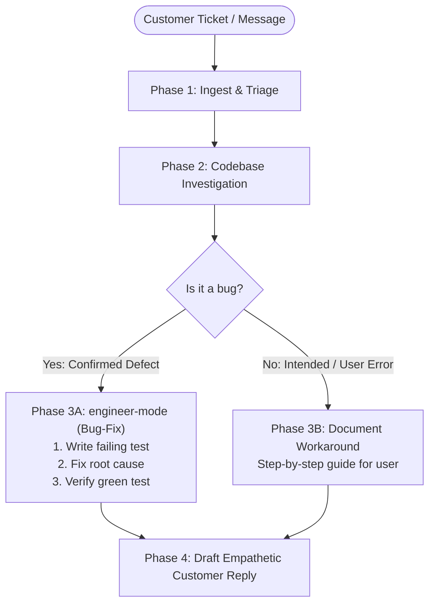

# Support Loop (Ticket-to-Fix-to-Reply)

The ultimate superpower of a technical founder is closing the loop between user pain, code fix, and customer communication in minutes instead of weeks of tiered customer service bureaucracy.

`support-loop` automates this entire lifecycle:
1. Parse the customer's inquiry.
2. Investigate the codebase and telemetry.
3. If it's a bug: trigger `engineer-mode`'s **Bug-fix playbook** (repro test, root cause fix, verify).
4. If it's intended behavior or user error: formulate the exact step-by-step workaround.
5. Draft an empathetic, clear, human customer response.

---

## When to Invoke

- A user reports a bug in your product via email, Discord, Slack, or GitHub issue.
- A paying customer hits an unexpected error (*"500 Internal Server Error when uploading file > 10MB"*).
- You want to verify whether a customer complaint is an actual bug or user misunderstanding before replying.

---

## The 4-Phase Protocol



---

### Phase 1: Ingest & Triage
Extract key facts:
- Who is the user? (Free tier, self-hosted, enterprise customer)
- What were they trying to accomplish?
- What was the observed symptom? (UI freeze, error code, unexpected value)
- What environment/browser/input data did they use?

### Phase 2: Codebase Investigation
Navigate the repository:
1. Search for matching error strings, endpoint routes, or UI components.
2. Trace the data flow: user input → validation → business logic → database/external API → response.
3. Identify if the edge case is handled or unhandled.

### Phase 3A: If Confirmed Bug → Trigger `engineer-mode`
Switch to `engineer-mode` with the **Bug-fix playbook** (`skills/engineer-mode/playbooks/bug-fix.md`):
1. **Reproduce First**: Write an isolated unit test or runtime script that reliably triggers the failure.
2. **Root Cause**: Trace the exact variable, null pointer, race condition, or schema mismatch.
3. **Fix**: Apply the minimal, cleanest fix per **principle-fix-root-causes** and **principle-laziness-protocol**.
4. **Verify**: Ensure the test passes, run existing regression tests, verify no blast radius.

### Phase 3B: If Not a Bug (Intended Behavior / Workaround)
- Pinpoint why the customer got confused (UX affordance, missing tooltip, documentation gap).
- Formulate the exact solution or workaround.
- Note any small UI/copy improvement to prevent future users from hitting the same issue.

### Phase 4: Draft the Customer Reply
The reply must follow strict human founder guidelines:
- **Validate Their Experience**: Never make the user feel dumb or blamed (*"Thanks for flagging this, you caught a real edge case"*).
- **Transparency**: Explain what happened in 1 plain English sentence without technical jargon overload.
- **Resolution**: Tell them what was done (fix deployed / how to resolve).
- **Next Step**: Ask them to verify or let you know if anything else looks off.

---

## Example Outputs

### Scenario A: Real Bug Fixed
```markdown
Hey David,

Thanks so much for writing in—you caught a genuine bug in our CSV parser. When column headers contained trailing spaces or parentheses, our schema validator was silently dropping the row instead of trimming it.

We just patched this and deployed the fix to production (commit `7f4a21`).

Could you refresh your dashboard and try exporting the file again? Everything should go through smoothly now.

Really appreciate you taking the time to report this!

Best,
Fabio
```

### Scenario B: User Configuration / Workaround
```markdown
Hey David,

Thanks for reaching out!

The reason the export stopped at 10,000 rows is that our real-time browser export is capped at 10k to prevent Chrome from running out of memory on large datasets.

To export your full 85,000 rows, you can use our background export feature:
1. Go to Reports → Export.
2. Select "Send full dataset to email (CSV/Parquet)".
3. You'll receive a secure download link in your inbox in about 30 seconds.

I realize that distinction wasn't clear on the dashboard button—we're updating the UI tooltip today so it's obvious to everyone.

Let me know if the email export gets you what you need!

Best,
Fabio
```
